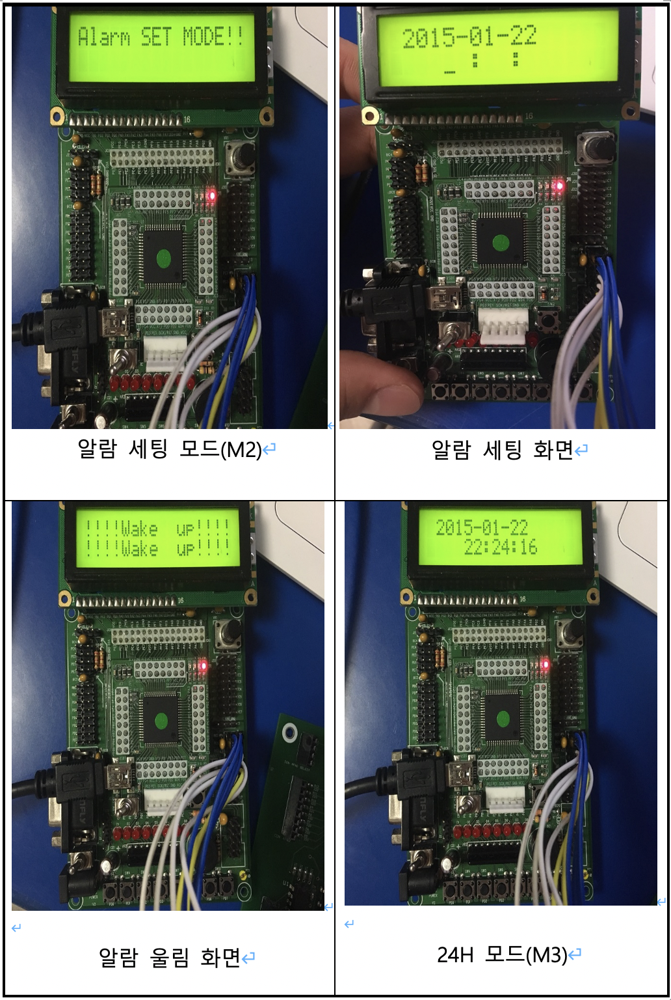
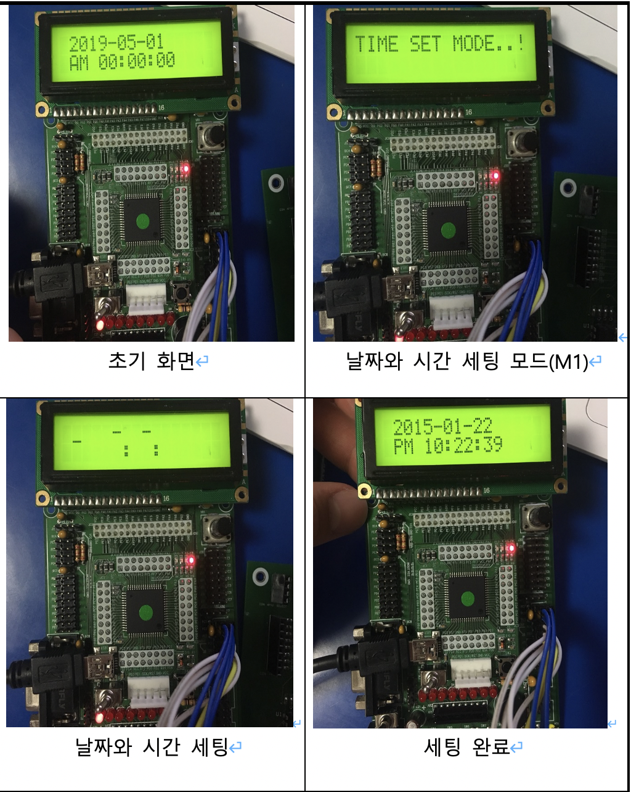

## 알람시계에 대한 정의

1. 초기 상태표시
   2 0 1 9 - 0 5 - 0 1
   A M 1 2 : 0 0 : 0 0

2. 키패드의 모드 키(M1)는 시간 설정용 키 (날짜부터 시간까지 설정)

3. 키패드의 모드 키(M2)는 알람 설정용 키 (알람 설정은 최대 3개까지 저장 가능)

4. 알람 발생시에는 부저를 이용하여 알람음을 음악으로 재생

5. 시간은 AM/PM 설정하여 표시
   M3누를 때 마다 24H 표시와 AM/PM으로 출력

## 문제를 해결하기 위한 전략

1. 초기 상태표시: 초기 상태를 표시할 때에 타이머 인터럽트에 사용되는 전역변수를 메인 문에 원하는 시간으로 초기화를 한다. \*문자열 자체를 바꾸면 초기상태에서 시간 카운트가 안된다.
2. 받은 키를 LCD에 출력하는 부분: 받은 키 값을 임의의 배열에 넣은 후에 배열의 원소 하나씩 LCD좌표값을 정해주고 함수(LCD_Char)을 통해서 출력한다.
3. 알람 설정 시 알람 시간 값 받는 부분: 알람 시간 받는 함수로 들어온 후 받은 키 값을 임의의 배열에 넣은 후 그 배열을 알람 시간을 저장하기 위한 배열에 다시 저장한다.
4. 저장한 알람을 울리는 부분: 3)에서 받은 알람 시간을 저장한 배열과 현재 나타나고 있는 시간이 같은 경우 부저 함수를 통해 알람을 울리게 한다.
5. 모드 키(M3)누르면 24H와 AM/PM으로 시간 표시하는 부분: M3를 누를 때 마다 Flag값을 반전 시켜서 Flag값 마다 24H표시와 AM/PM으로 출력할 수 있도록 한다.

[x] 채터링(Chattering)에 대한 해결 방법: delay_ms 함수를 사용하면 일반적으로 해결되지만 불필요한 대기 시간을 초래할 수 있기 때문에 소프트웨어 적으로 채터링을 해결해야한다.

## 프로그램 순서도

## 프로그램 설명

1. 프로그램이 시작하면 초기 상태화면이 출력된다. 그리고 M1버튼을 누르면 새 비밀번호를 만들 수 있는 함수로 들어가게 된다.
2. 원하는 비밀번호 4자리를 입력하고 #키 누르면 완료되었다는 텍스트와 함께 금고는 열리게 된다.
3. LCD 윗줄은 금고의 잠금상태(OPEN/CLOSED)와 입력한비밀번호가 틀렸을 경우 경고 메시지 횟수가 출력된다.2번째 줄에서는 금고를 열기위한 비밀번호를 입력할 수 있다.
4. #키는 4자리 입력 후 엔터 키이고 M2키는 입력한 비밀번호를 지울 수 있는 Delete키이다. 금고가 열렸을 경우 \*키를 누르면 부저 소리와 함께 금고가 다시 닫힌다.
5. 비밀번호가 틀렸을 경우에는 경고음과 함께 LCD첫번째줄 오른쪽에 틀린 횟수가 카운트된다. 3번째도 틀렸을 경우에는 관리자 코드 입력 함수로 들어간다.
6. 관리자 코드10자리를 입력하고 #키 누르면 다시 메인 화면으로 돌아가고 금고는 OPEN상태가 된다. M1버튼을 다시 눌러 새비밀번호를 입력한다.  
   [x]관리자 모드에서는 10자리를 정확히 맞게 입력할 때까지 무한히 입력을 받는다.  
   [x]비밀번호를 입력할 때에는 \*\*\*\*로 출력이 된다.  
   [x]금고가 닫힌 상태에서는 새 비밀번호를 저장할 수 있는 함수로 들어가지 못한다.

## 동작 사진

