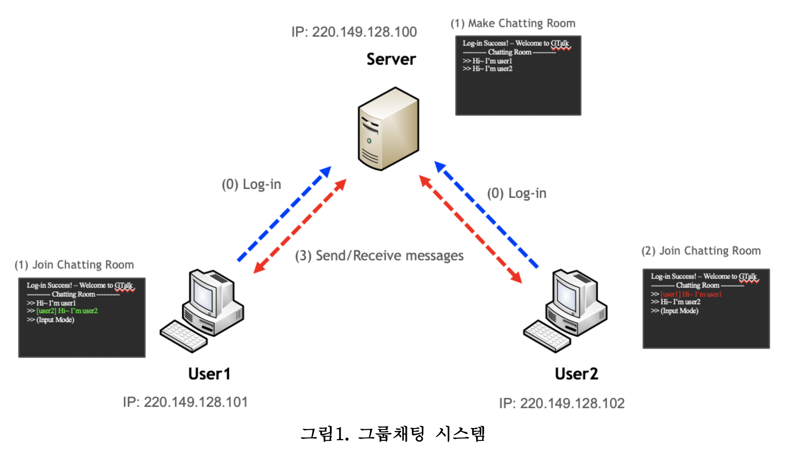

## 개발 언어

C 언어

---

## 개발 환경

운영체제: 리눅스

개발 도구: Vim

---

## 프로젝트 내용

- 3학년 2학기 임베디드 운영체제 프로젝트
- TCP/IP 소켓 프로그래밍
- 서버를 통해 다수의 클라이언트들이 로그인을 하여 채팅할 수 있는 프로그램
- 공유 메모리, 교착상태, 세마포어 등 OS 지식을 활용하여 개발

## 프로젝트 프로세스

1. 클라이언트(User1)는 서버에 접속하여 로그인을 한다.
2. User1이 접속하면 서버는 채팅룸 화면을 생성하고, User1도 채팅룸 화면을 보여준다. (채팅 룸 화면은 채팅룸이라는 메시지와 “>>” 프롬프트 표시로 입력이 가능한 상태임을 보여주는 것)
3. User2도 동일하게 서버에 접속하고, 로그인이 성공하면 채팅룸 화면을 보여준다.
4. User1은 키보드 입력을 받을 수 있는 상태이며, 키보드로부터 입력을 받으면 메시지로 만들어 서버로 전송한다. (단, 키보드 입력이 가능한 모드이지만 User2로부터 메시지를 받으면 채팅창에 수신한 상대방의 메시지를 출력할 수 있어야 한다.)
5. 서버가 User1으로부터 메시지를 수신하면 사용자이름 “[User1]”을 메시지 앞에 붙여서 User2로 전송한다. (hint: strcat() 또는 strncat() 스트링 연결함수 이용)
6. User2는 서버로부터 수신한 메시지를 채팅룸에 출력하고, 키보드로부터 메시지를 입력 받으면 같은 방식으로 서버로 입력받은 메시지를 전송한다.
7. User1과 User2는 이런 방식으로 서로 키보드 입력을 받으면 서버로 메시지를 전송하고, 서버로부터 상대방의 메시지를 받으면 채팅창 화면에 출력하는 것을 반복하여 채팅이 되도 록 한다.
