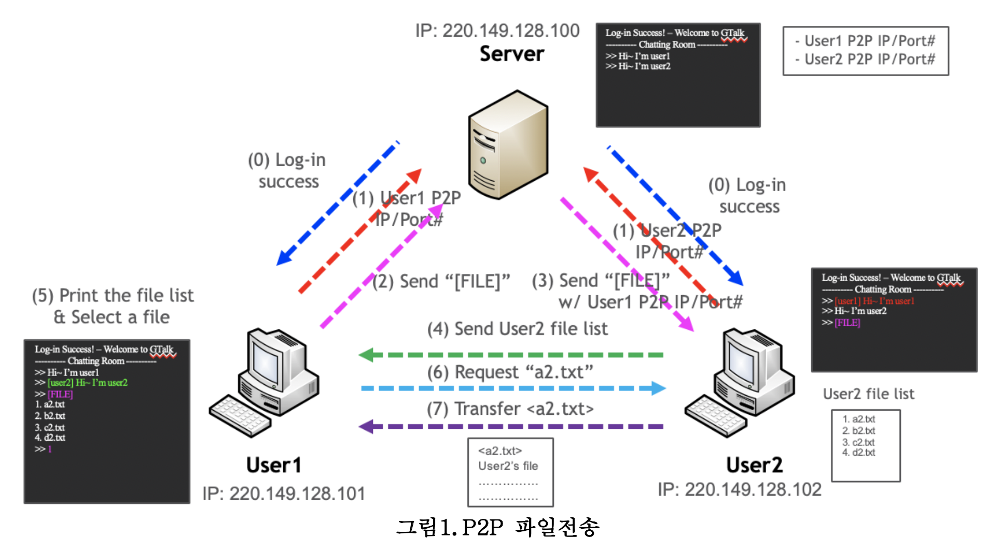

## 개발 언어

C 언어

---

## 개발 환경

운영체제: 리눅스

개발 도구: Vim

---

## 프로젝트 내용

- 3학년 2학기 임베디드 운영체제 프로젝트
- TCP/IP 소켓 프로그래밍
- 서버를 통해 다수의 클라이언트들이 로그인을 하여 채팅할 수 있는 프로그램
- 채팅 도중 [FILE] 커맨드를 통해 특정 사용자가 다른 사용자와 p2p 파일 전송을 할 수 있도록 구현
- 공유 메모리, 교착상태, 세마포어, 파일 입출력 등 OS 지식을 활용하여 개발

---

## 성능 수준

[x] 기본적인 파일 송수신 구현  
[x] 추가적으로 클라이언트 2개 이상 채팅방에 있을 경우 P2P통신을 하기 위해 자신이 원하는 유저와 P2P통신이 가능  
[x] P2P 통신을 원하지 않는 경우도 있기 때문에 추가적인 special msg(/N or /Y)를 이용하여 수락 거절이 가능  
[x] 받고 싶은 파일을 원하는 만큼 다운로드 하고 /q 메시지를 통해 파일 송수신을 멈추고 채팅방으로 진입
