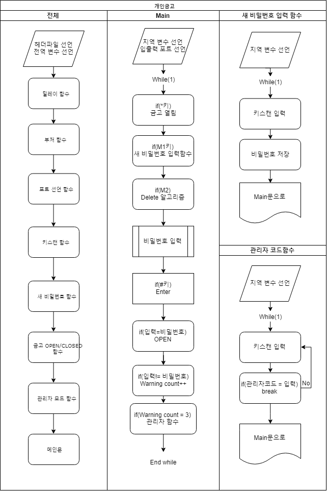
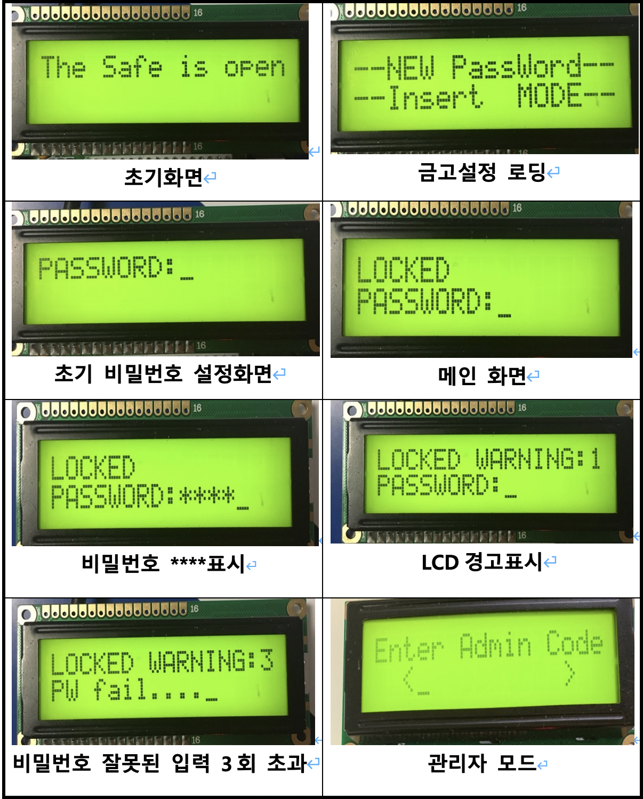

## 개인 금고에 대한 정의

1. 초기 상태표시
   K P U S a f e . .

2. 금고 비밀번호를 저장하기 위해 모드 키(M1)을 누름. 비밀번호를 입력하면 저장되어 기억되고, 금고의 문은 닫힘 상태로 된다.(LCD에 표기되어야 함)
3. 금고의 문을 열기 위해 4자리 숫자를 입력하고 일치하면 문이 열림음과 동시에 열리고, 일치하지 않으면 실패음을 출력한다.

4. 세 번 이상 오류 입력이면 영구히 닫힘 상태가 되고, 관리자 코드를 입력하면 열리도록 프로그램을 작성한다.(관리자 코드는 모드키와 숫자 키를 조합하여 10자 정도로 지정하여 EEPROM에 미리 저장하거나, 초기에 관리자 코드로 입력하여 기억하도록 한다.

## 프로그램 순서도

## 프로그램 설명

1. 프로그램이 시작하면 초기 상태화면이 출력된다. 그리고 M1버튼을 누르면 새 비밀번호를 만들 수 있는 함수로 들어가게 된다.
2. 원하는 비밀번호 4자리를 입력하고 #키 누르면 완료되었다는 텍스트와 함께 금고는 열리게 된다.
3. LCD 윗줄은 금고의 잠금상태(OPEN/CLOSED)와 입력한비밀번호가 틀렸을 경우 경고 메시지 횟수가 출력된다.2번째 줄에서는 금고를 열기위한 비밀번호를 입력할 수 있다.
4. #키는 4자리 입력 후 엔터 키이고 M2키는 입력한 비밀번호를 지울 수 있는 Delete키이다. 금고가 열렸을 경우 \*키를 누르면 부저 소리와 함께 금고가 다시 닫힌다.
5. 비밀번호가 틀렸을 경우에는 경고음과 함께 LCD첫번째줄 오른쪽에 틀린 횟수가 카운트된다. 3번째도 틀렸을 경우에는 관리자 코드 입력 함수로 들어간다.
6. 관리자 코드10자리를 입력하고 #키 누르면 다시 메인 화면으로 돌아가고 금고는 OPEN상태가 된다. M1버튼을 다시 눌러 새비밀번호를 입력한다.  
   [x]관리자 모드에서는 10자리를 정확히 맞게 입력할 때까지 무한히 입력을 받는다.  
   [x]비밀번호를 입력할 때에는 \*\*\*\*로 출력이 된다.  
   [x]금고가 닫힌 상태에서는 새 비밀번호를 저장할 수 있는 함수로 들어가지 못한다.

## 동작 사진

